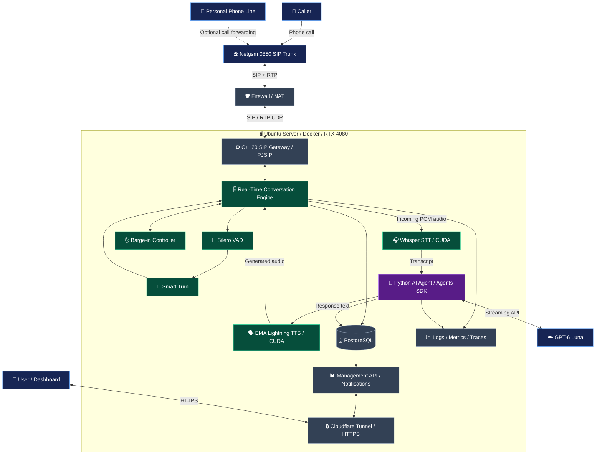
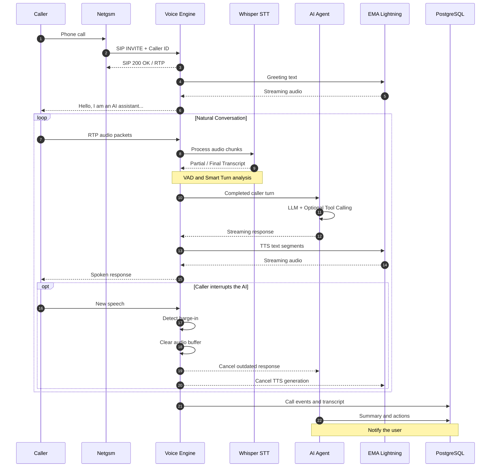
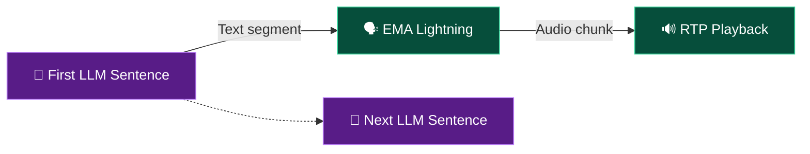

<a id="top"></a>

<div align="center">

# ☎️ Alojan

### Your calls. Your AI agents. Your infrastructure.

**A self-hostable AI voice agent engine for real-time phone conversations, being developed as an open-source project.**

Build AI agents that answer phone calls, listen naturally, understand callers, speak, and take action when needed.

**Without depending on hosted voice AI platforms such as Vapi or Retell AI.**

<br />

[](https://github.com/burhancetinkaya/alojan)
[](#architecture)
[](#technology-stack)
[](#technology-stack)

<br />

[](#technology-stack)
[](#technology-stack)
[](#architecture)
[](#why-alojan)

<br />

[**Why Alojan?**](#why-alojan) ·
[**Features**](#planned-features) ·
[**Architecture**](#architecture) ·
[**Conversation Engine**](#conversation-engine) ·
[**Roadmap**](#roadmap) ·
[**Contributing**](#contributing)

</div>

---

<a id="why-alojan"></a>

## ✨ Why Alojan?

**Alo** is how a phone conversation begins in Turkish.

**Ajan** means an agent: an autonomous AI system that can perform specific tasks.

**Alo + Ajan = Alojan**

Alojan aims to provide a voice AI engine that answers incoming calls, listens to callers, understands why they are calling, speaks natural Turkish, and uses tools to take action when appropriate.

The starting point is a personal AI phone assistant. The long-term goal is modular infrastructure that developers can use to build their own voice agents.

<table>
<tr>
<td width="33%" align="center">
<strong>🎙️ Natural Conversations</strong><br/>
<sub>Intelligent silence detection, turn management, and interruption handling.</sub>
</td>
<td width="33%" align="center">
<strong>🧠 Agentic AI</strong><br/>
<sub>LLMs, tool calling, MCP, and extensible agent capabilities.</sub>
</td>
<td width="33%" align="center">
<strong>🔐 You Are in Control</strong><br/>
<sub>Your SIP infrastructure, your voice engine, your server.</sub>
</td>
</tr>
</table>

> [!IMPORTANT]
> **Project status: Early development / architecture planning**
>
> This repository currently contains the project README; there is no runnable implementation yet.
> Alojan is not ready for production use. The features and architecture below describe the intended design, not completed functionality.
> The roadmap will be updated as features are implemented and validated. An open-source license has not yet been selected; see [License](#license).

---

<a id="planned-features"></a>

## 🚀 Planned Features

| | Feature | Description |
|:--:|---|---|
| 📞 | **SIP / RTP Telephony** | Answer phone calls directly through a SIP trunk. |
| 🎙️ | **Real-Time Conversation** | Process audio and generate responses with low latency. |
| 🧠 | **Intelligent Turn Detection** | Distinguish a brief pause from the end of a caller's turn. |
| ✋ | **Barge-in** | Stop the AI's speech when the caller starts speaking. |
| 🔊 | **Streaming TTS** | Start speaking before the entire response is ready. |
| 🎯 | **Turkish-First Experience** | Optimize speech processing for Turkish phone conversations. |
| 🧩 | **Tool Calling** | Integrate calendars, contacts, notifications, and custom APIs. |
| 🔌 | **MCP Support** | Provide an extensible architecture for tools on external MCP servers. |
| 📝 | **Call Records and Summaries** | Store transcripts, caller details, summaries, and action items. |
| 🐳 | **Self-Hosted Deployment** | Run on your own Linux server with Docker Compose. |
| ⚡ | **GPU Acceleration** | Run local STT and TTS inference with NVIDIA CUDA. |
| 📊 | **Observability** | Measure latency, RTP quality, interruptions, and agent performance. |

---

<a id="architecture"></a>

## 🏗️ System Architecture

Alojan is designed as a modular system that manages its own telephony infrastructure and real-time conversation engine.

SIP/RTP, STT, TTS, and conversation orchestration are intended to run on a self-hosted server. The planned GPT-6 Luna integration uses an external API.



### Core Architectural Principles

- **Independent telephony infrastructure.** The SIP gateway operates independently of the agent framework.
- **A dedicated conversation engine.** VAD, turn management, and interruption control belong to the engine.
- **Separate AI services.** STT, TTS, and agent services can be developed independently.
- **Replaceable model providers.** Interfaces are designed to support alternative LLM, STT, and TTS providers in the future.
- **gRPC streaming.** C++ and Python services communicate through low-latency, bidirectional streams.
- **Cloudflare Tunnel is for HTTP only.** SIP/RTP UDP traffic is routed directly through the firewall.

---

## 📡 How a Phone Call Will Be Processed



---

<a id="conversation-engine"></a>

## 🧠 Natural Conversation Engine

A voice AI system needs more than a **Speech-to-Text → LLM → Text-to-Speech** pipeline.

During a phone call, the assistant needs to know when to speak, when to remain silent, and how to react when interrupted. Alojan aims to manage these behaviors within its **Real-Time Conversation Engine**.

### 🎯 Intelligent Turn Detection

A caller may pause briefly while speaking:

> "Hello, about tomorrow's meeting..."
>
> *(one second of silence)*
>
> "...I wanted to make a change."

If the system relies only on silence duration, the AI may interrupt too early. The planned process is:

1. Detect speech and silence using **Silero VAD**.
2. Estimate whether the caller has finished using **Smart Turn**.
3. Consider the ongoing dialogue through **conversation context**.
4. Send the completed turn to the AI agent.

### ✋ Barge-in: Interrupting the AI

Callers should be able to interrupt the AI naturally:

> **Alojan:** All right, the meeting is tomorrow at...
>
> **Caller:** No, not tomorrow. Friday.
>
> **Alojan:** Understood. I'll correct that to Friday.

In this scenario, the engine is intended to:

- Detect the caller's new speech.
- Clear queued AI audio packets.
- Cancel ongoing TTS generation.
- Stop the outdated LLM response.
- Process the new speech.

Background noise, brief acknowledgments, and audio echo will also be considered to reduce false interruptions.

### ⚡ Streaming LLM + Streaming TTS

Responses will be split into segments instead of waiting for the LLM to finish the entire response.



This allows the LLM to generate the next sentence while TTS speaks the first one.

### 🔧 Conversation Engine Components

| Component | Responsibility |
|---|---|
| Silero VAD | Detect speech and silence |
| Smart Turn v3.2 | Estimate when a caller's turn is complete |
| Adaptive Endpointing | Adjust waiting periods dynamically |
| Barge-in Controller | Handle intentional interruptions |
| Echo-aware Detection | Reduce false detections caused by audio echo |
| Playback Accounting | Track which part of a response the caller actually heard |
| Response Cancellation | Cancel outdated LLM and TTS work |
| Conversation State | Manage dialogue context and call state |

<details>
<summary><strong>⚡ Initial Performance Targets</strong></summary>

These are goals, not measured benchmark results.

| Metric | Target |
|---|---|
| P50 response onset | Under 1 second |
| P95 response onset | Under 1.8 seconds |
| Barge-in stop latency | Under 250 ms |
| Premature turn cutoff rate | Under 2% |
| False interruption rate | Under 3% |

Actual results will be measured against a test dataset of Turkish phone conversations.

</details>

---

<a id="technology-stack"></a>

## 🛠️ Planned Technology Stack

| Layer | Technology | Purpose |
|---|---|---|
| Telephony | **C++20 + PJSIP / PJSUA2** | SIP, RTP, and call management |
| Voice Engine | **Custom C++ Engine** | Audio and conversation orchestration |
| VAD | **Silero VAD / ONNX** | Speech detection |
| Turn Detection | **Smart Turn v3.2** | End-of-turn detection |
| STT | **Faster-Whisper** | Turkish speech recognition |
| Agent Runtime | **OpenAI Agents SDK** | Agent orchestration and tool calling |
| LLM | **GPT-6 Luna API** | Dialogue and decision-making |
| TTS | **EMA Lightning** | Turkish speech generation |
| Communication | **gRPC + Protocol Buffers** | Streaming between services |
| Database | **PostgreSQL** | Call records and actions |
| Deployment | **Docker Compose** | Self-hosted operation |
| GPU | **NVIDIA CUDA** | Accelerated inference |
| Management API | **HTTP API** | Call results and notifications |
| Observability | **OpenTelemetry** | Logs, traces, and metrics |

### 🗣️ EMA Lightning

[EMA Lightning on Hugging Face](https://huggingface.co/canberkkkkkk/ema-lightning) is the planned model for streaming Turkish speech generation.

### 🎧 Faster-Whisper

Speech recognition is planned to use Faster-Whisper with CUDA, starting with the `large-v3-turbo` model.

### 🧠 AI Agent

The agent layer is planned around the **OpenAI Agents SDK**, with support for:

- Streaming LLM responses
- Function calling
- MCP tool integrations
- Conversation context
- Caller intent recognition
- Structured post-call summaries
- Authorized actions in external systems

> [!NOTE]
> Alojan's SIP, conversation management, STT, and TTS components are designed to be self-hosted.
>
> The default architecture is not fully offline because the planned GPT-6 Luna integration uses an external API.

---

## 💬 Example Phone Conversation

The following example is translated into English; the initial experience targets Turkish conversations.

**Alojan:**

> Hello! I'm the AI assistant for the person you're calling. They are unavailable right now. Who am I speaking with?

**Caller:**

> Hi, I'm Ayşe. I'd like to move our meeting tomorrow to 4:00 PM.

**Alojan:**

> Understood, Ayşe. I'll pass along your request to move tomorrow's meeting to 4:00 PM. Is there anything else you'd like to add?

**Caller:**

> No, thank you.

**Alojan:**

> You're welcome. I've noted your request. Have a good day!

### 📝 After the Call

Alojan aims to record structured information such as the following. The summary and action text are translated into English for this example; `language` identifies the original call language.

```json
{
  "call_id": "call_example_001",
  "caller_number": "+90532XXXXXXX",
  "caller_name": "Ayşe",
  "language": "tr",
  "intent": "meeting_reschedule",
  "summary": "The caller wants to reschedule tomorrow's meeting to 4:00 PM.",
  "priority": "medium",
  "action_required": true,
  "action": "Notify the user of the meeting rescheduling request.",
  "status": "completed"
}
```

> This is an illustrative call result, not output from a working implementation.
> Caller ID is obtained automatically when provided by the carrier. A phone number alone is not treated as proof of identity.

---

## 🧱 Planned Repository Structure

The following directories and files describe the intended layout; they have not yet been created.

```text
alojan/
├── services/
│   ├── voice-gateway/
│   │   └── C++20 / SIP / RTP / Conversation Engine
│   │
│   ├── asr-service/
│   │   └── Faster-Whisper / CUDA
│   │
│   ├── tts-service/
│   │   └── EMA Lightning / CUDA
│   │
│   ├── agent-service/
│   │   └── OpenAI Agents SDK / Tools / MCP
│   │
│   └── app-api/
│       └── Private API / Notifications
│
├── proto/
│   └── voice/v1/
│       └── gRPC Contracts
│
├── infra/
│   ├── docker/
│   └── compose/
│
├── docs/
│   ├── architecture/
│   ├── deployment/
│   └── security/
│
├── tests/
│   ├── unit/
│   ├── integration/
│   └── performance/
│
├── scripts/
├── PRD.md
└── README.md
```

---

<a id="roadmap"></a>

## 🗺️ Development Roadmap

Development is planned in stages. All milestones below remain open.

- [ ] **M0 — Foundation**
  - Project scaffolding
  - Docker Compose configuration
  - NVIDIA GPU access
  - C++ / Python service structure
  - gRPC contracts

- [ ] **M1 — SIP / RTP**
  - PJSIP integration
  - Incoming call handling
  - G.711 codec support
  - RTP audio transmission and reception
  - NAT and firewall testing

- [ ] **M2 — Speech Pipeline**
  - Faster-Whisper STT
  - EMA Lightning TTS
  - Streaming audio pipeline
  - GPU optimizations

- [ ] **M3 — Conversation Engine**
  - Silero VAD
  - Smart Turn
  - Adaptive endpointing
  - Barge-in
  - Playback tracking
  - Echo-aware interruption

- [ ] **M4 — AI Agent**
  - GPT-6 Luna integration
  - OpenAI Agents SDK
  - Streaming responses
  - Tool calling
  - Call summaries
  - Extensible infrastructure for MCP

- [ ] **M5 — Operations**
  - PostgreSQL
  - Call history
  - Transcript and action records
  - User notifications
  - Management API
  - Monitoring and security

- [ ] **M6 — Real-World Testing**
  - Netgsm SIP trunk tests
  - Turkcell call forwarding
  - Caller ID validation
  - Turkish conversation tests
  - Latency and performance benchmarks

Follow development through [GitHub Issues](https://github.com/burhancetinkaya/alojan/issues).

---

## 🐳 Development & Deployment

### Reference Hardware

The initial development environment targets:

| Component | Configuration |
|---|---|
| Operating System | Ubuntu Linux |
| GPU | NVIDIA RTX 4080 |
| VRAM | 16 GB |
| Container Runtime | Docker |
| Orchestration | Docker Compose |
| GPU Runtime | NVIDIA Container Toolkit |
| Telephony Connection | SIP Trunk / Public IPv4 |

### Clone the Repository

```bash
git clone https://github.com/burhancetinkaya/alojan.git
cd alojan
```

> [!WARNING]
> The project is in early development. Cloning the repository does not provide a runnable service yet.
> Working deployment instructions will be published with the first validated release.

### Telephony

The proposed initial configuration is:

```text
SIP: UDP 5060
RTP: UDP 10000-10100
```

These ports are intended to be configurable. SIP and RTP access should be restricted to authorized carrier IP addresses.

### GPU Inference

ASR and TTS models are designed to run in Docker containers with NVIDIA GPU access. Inference services will remain ready between calls instead of reloading models for every call.

---

## 🔐 Privacy and Security

Security and personal data protection are core design goals. Planned safeguards include:

- The assistant identifies itself as AI at the beginning of the call.
- It does not impersonate the phone's owner.
- Raw audio is not recorded by default.
- Phone numbers, transcripts, and call history are access-controlled.
- A phone number alone is not accepted as authentication.
- Tool calls pass through authorization checks.
- Actions such as changing calendars or sending messages require appropriate user authorization and approval.
- Sensitive information is excluded from logs.
- API keys and SIP credentials are kept out of the repository.
- The management API requires authentication.
- Firewall rules restrict SIP/RTP access.

Real-world deployments must account for applicable personal data protection obligations, including Türkiye's KVKK.

---

<a id="contributing"></a>

## 🤝 Contributing

Alojan is being developed with an open-source approach. Contributions are especially welcome in:

- SIP / RTP protocol development
- Real-time audio processing
- Turkish speech recognition optimization
- TTS model integration
- Turn detection and barge-in
- Agent framework integration
- Performance and latency optimization
- Security and documentation

**Get involved:**

- 💡 [Open an issue](https://github.com/burhancetinkaya/alojan/issues)
- 🔧 [Submit a pull request](https://github.com/burhancetinkaya/alojan/pulls)
- ⭐ Star the project to follow its progress.

<a id="license"></a>

### 📜 License

An open-source license will be selected before the first distributable release.

Distribution compatibility of dependencies, including PJSIP's GPL and commercial licensing terms, will be evaluated.

Until a license is added, do not assume unrestricted rights to reuse the source code.

---

<div align="center">

## ☎️ Alojan

### Alo + Ajan = Alojan

**Your calls. Your AI agents. Your infrastructure.**

*Rethink phone conversations with AI.*

<br />

[**GitHub**](https://github.com/burhancetinkaya/alojan) ·
[**Issues**](https://github.com/burhancetinkaya/alojan/issues) ·
[**Back to Top**](#top)

<br />

**Made in Türkiye · Built for the world**

</div>
