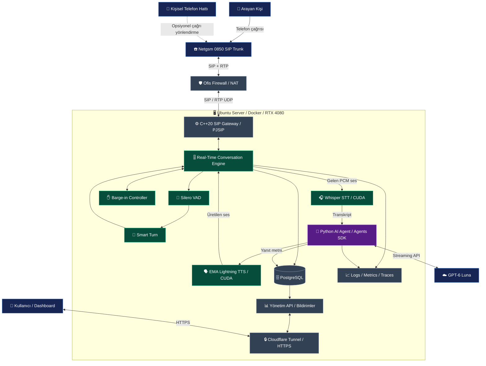
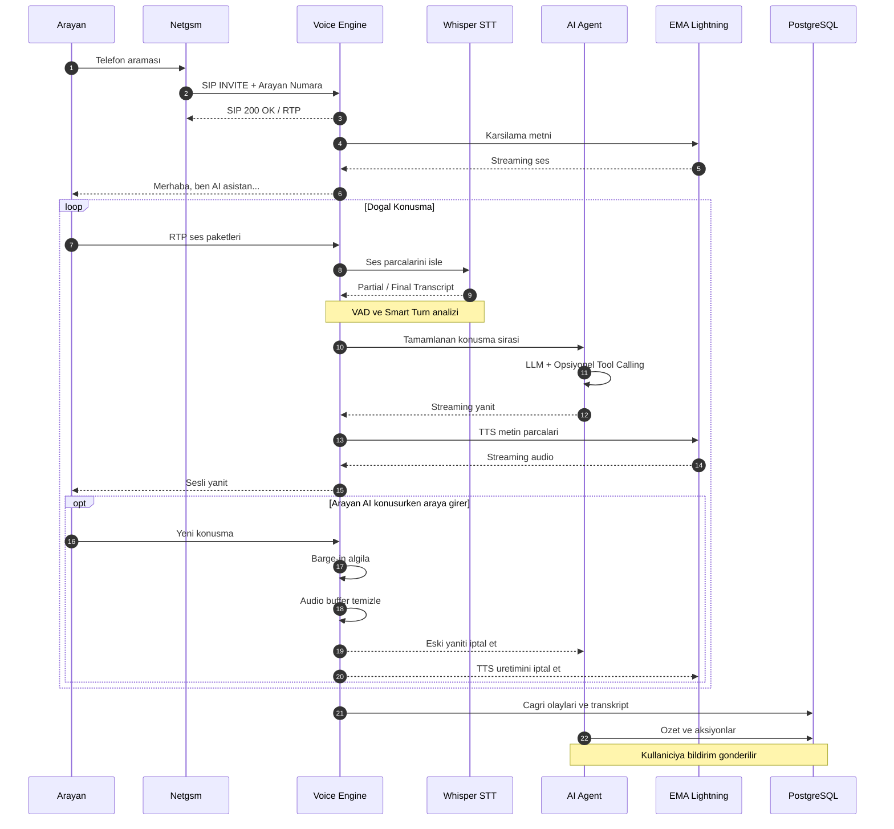
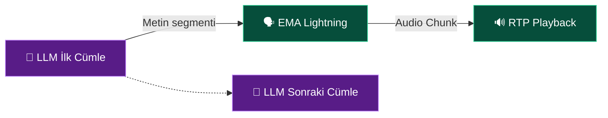

<a id="top"></a>

<div align="center">

# ☎️ Alojan

### Senin çağrıların. Senin AI ajanların. Senin altyapın.

**Gerçek zamanlı telefon görüşmeleri için açık kaynaklı, kendi sunucunda çalışabilen yapay zekâ sesli ajan motoru.**

Telefon çağrılarını karşılayan, doğal şekilde dinleyen, konuşan, anlayan ve gerektiğinde aksiyon alan yapay zekâ ajanları oluştur.

**Vapi veya Retell AI gibi hazır Voice AI platformlarına bağımlı olmadan.**

<br />

[](https://github.com/burhancetinkaya/alojan)
[](#mimari)
[](#teknoloji-yigini)
[](#teknoloji-yigini)

<br />

[](#teknoloji-yigini)
[](#teknoloji-yigini)
[](#mimari)
[](#neden-alojan)

<br />

[**Neden Alojan?**](#neden-alojan) ·
[**Özellikler**](#planlanan-ozellikler) ·
[**Mimari**](#mimari) ·
[**Konuşma Motoru**](#dogal-konusma-motoru) ·
[**Yol Haritası**](#yol-haritasi) ·
[**Katkıda Bulun**](#katkida-bulun)

</div>

---

<a id="neden-alojan"></a>

## ✨ Neden Alojan?

**Alo**, Türkçede bir telefon görüşmesinin başlangıcıdır.

**Ajan**, belirli görevleri yerine getirebilen otonom yapay zekâ sistemlerini ifade eder.

**Alo + Ajan = Alojan**

Alojan, gelen telefon çağrılarını karşılayan, arayan kişiyi dinleyen, neden aradığını anlayan, doğal Türkçe konuşan ve gerektiğinde araçlar kullanarak aksiyon alabilen açık kaynaklı bir Voice AI Engine projesidir.

Başlangıç noktası kişisel bir yapay zekâ telefon asistanı olsa da uzun vadeli hedefimiz geliştiricilerin kendi sesli ajanlarını oluşturabilecekleri modüler bir altyapı sunmaktır.

<table>
<tr>
<td width="33%" align="center">
<strong>🎙️ Doğal Konuşmalar</strong><br/>
<sub>Akıllı sessizlik algılama, konuşma sırası yönetimi ve söz kesme desteği.</sub>
</td>
<td width="33%" align="center">
<strong>🧠 Agentic AI</strong><br/>
<sub>LLM, tool calling, MCP ve genişletilebilir ajan yetenekleri.</sub>
</td>
<td width="33%" align="center">
<strong>🔐 Kontrol Sende</strong><br/>
<sub>Kendi SIP altyapın, kendi ses motorun, kendi sunucun.</sub>
</td>
</tr>
</table>

> [!IMPORTANT]
> **Proje durumu: Aktif geliştirme**
>
> Alojan henüz production kullanımına hazır değildir.
> Bu README içerisinde açıklanan özellikler ve mimari, projenin hedeflenen tasarımını temsil etmektedir.
> Doğrulanan özellikler tamamlandıkça yol haritası güncellenecektir.

---

<a id="planlanan-ozellikler"></a>

## 🚀 Planlanan Özellikler

| | Özellik | Açıklama |
|:--:|---|---|
| 📞 | **SIP / RTP Telefon Altyapısı** | SIP trunk üzerinden doğrudan telefon çağrılarını karşılama. |
| 🎙️ | **Gerçek Zamanlı Konuşma** | Ses verisini düşük gecikmeyle işleme ve yanıt üretme. |
| 🧠 | **Akıllı Konuşma Sırası Algılama** | Arayanın durakladığını mı yoksa sözünü tamamen bitirdiğini mi anlama. |
| ✋ | **Barge-in** | Arayan konuşmaya başladığında AI'ın konuşmasını kesebilme. |
| 🔊 | **Streaming TTS** | Yanıtın tamamını beklemeden konuşmaya başlama. |
| 🎯 | **Türkçe Öncelikli Deneyim** | Türkçe telefon görüşmelerine göre optimize edilmiş ses işleme. |
| 🧩 | **Tool Calling** | Takvim, rehber, bildirim ve özel API entegrasyonları. |
| 🔌 | **MCP Desteği** | Harici MCP sunucularındaki araçlara erişim için genişletilebilir mimari. |
| 📝 | **Çağrı Kayıtları ve Özetler** | Transkript, arayan bilgisi, görüşme özeti ve aksiyon listesi. |
| 🐳 | **Self-Hosted Deployment** | Docker Compose ile kendi Linux sunucunda çalıştırma. |
| ⚡ | **GPU Acceleration** | NVIDIA CUDA ile yerel STT ve TTS inference. |
| 📊 | **Observability** | Gecikme, RTP kalitesi, interruption ve agent performans metrikleri. |

---

<a id="mimari"></a>

## 🏗️ Sistem Mimarisi

Alojan, telefon altyapısını ve gerçek zamanlı konuşma motorunu kendi içerisinde yöneten modüler bir sistem olarak tasarlanmaktadır.

SIP/RTP, STT, TTS ve konuşma orkestrasyonu kendi sunucumuzda çalışır. Seçilen GPT-6 Luna modeli ise harici API üzerinden kullanılır.



### Temel Mimari İlkeler

- **Telefon altyapısı bağımsızdır.** SIP Gateway, agent framework'ünden bağımsız çalışır.
- **Conversation Engine bize aittir.** VAD, konuşma sırası yönetimi ve interruption kontrolü kendi motorumuzda gerçekleştirilir.
- **AI servisleri ayrıdır.** STT, TTS ve Agent servisleri bağımsız olarak geliştirilebilir.
- **Model bağımlılığı azaltılır.** İleride farklı LLM, STT ve TTS sağlayıcılarına geçiş mümkün olacak şekilde arayüzler tasarlanır.
- **gRPC Streaming kullanılır.** C++ ve Python servisleri düşük gecikmeli, çift yönlü iletişim kurar.
- **Cloudflare Tunnel yalnızca HTTP içindir.** SIP/RTP UDP trafiği doğrudan firewall üzerinden yönlendirilir.

---

## 📡 Bir Telefon Görüşmesi Nasıl İşlenir?



---

<a id="dogal-konusma-motoru"></a>

## 🧠 Doğal Konuşma Motoru

İyi bir Voice AI sistemi yalnızca aşağıdaki akıştan ibaret değildir:

**Speech-to-Text → LLM → Text-to-Speech**

Gerçek bir telefon görüşmesinde asistanın ne zaman konuşacağını, ne zaman susacağını ve araya girildiğinde nasıl davranacağını bilmesi gerekir.

Alojan bu davranışları kendi **Real-Time Conversation Engine** içerisinde yönetmeyi hedefler.

### 🎯 Akıllı Turn Detection

Arayan kişi konuşurken kısa süreli duraklayabilir.

Örneğin:

> "Merhaba, yarınki toplantıyla ilgili..."
>
> *(1 saniye sessizlik)*
>
> "...bir değişiklik yapmak istiyordum."

Sistem yalnızca sessizlik süresine göre karar verirse AI yanlışlıkla araya girer.

Bu nedenle:

1. **Silero VAD** ile konuşma ve sessizlik tespit edilir.
2. **Smart Turn** ile konuşmanın tamamlanıp tamamlanmadığı tahmin edilir.
3. **Conversation Context** ile mevcut diyalog dikkate alınır.
4. Gerçekten tamamlanan konuşma sırası AI Agent'a gönderilir.

### ✋ Barge-in: AI'ın Sözünü Kesebilme

Doğal bir görüşmede arayan kişi AI konuşurken araya girebilmelidir.

Örnek:

> **Alojan:** Tamamdır, toplantıyı yarın saat...
>
> **Arayan:** Hayır, yarın değil cuma günü.
>
> **Alojan:** Anladım, cuma günü olarak düzeltiyorum.

Bu senaryoda:

- Arayanın yeni konuşması algılanır.
- AI'ın bekleyen ses paketleri temizlenir.
- Devam eden TTS üretimi iptal edilir.
- Geçersiz LLM yanıtı durdurulur.
- Yeni konuşma işlenir.

Yanlış interruption'ları azaltmak için arka plan gürültüsü, kısa onay ifadeleri ve ses yankısı da dikkate alınır.

### ⚡ Streaming LLM + Streaming TTS

LLM'in bütün yanıtı üretmesini beklemek yerine yanıtlar parçalara ayrılır.



Böylece TTS ilk cümleyi seslendirirken LLM sonraki cümleyi üretmeye devam edebilir.

### 🔧 Conversation Engine Bileşenleri

| Bileşen | Görevi |
|---|---|
| Silero VAD | Konuşma ve sessizlik tespiti |
| Smart Turn v3.2 | Konuşma sırasının tamamlandığını tahmin etme |
| Adaptive Endpointing | Dinamik bekleme süreleri |
| Barge-in Controller | Gerçek söz kesmeleri yönetme |
| Echo-aware Detection | Ses yankısından kaynaklanan yanlış algılamaları azaltma |
| Playback Accounting | Arayanın gerçekten duyduğu konuşma bölümünü takip etme |
| Response Cancellation | Geçersiz LLM ve TTS işlemlerini iptal etme |
| Conversation State | Görüşme bağlamı ve durum yönetimi |

<details>
<summary><strong>⚡ İlk Performans Hedefleri</strong></summary>

Bunlar hedef değerlerdir. Henüz ölçülmüş benchmark sonuçları değildir.

| Metrik | Hedef |
|---|---|
| P50 yanıt başlangıcı | 1 saniyenin altı |
| P95 yanıt başlangıcı | 1,8 saniyenin altı |
| Barge-in durdurma süresi | 250 ms altı |
| Erken konuşma kesme oranı | %2 altı |
| Yanlış interruption oranı | %3 altı |

Gerçek sonuçlar Türkçe telefon görüşmelerinden oluşturulacak test veri seti üzerinde ölçülecektir.

</details>

---

<a id="teknoloji-yigini"></a>

## 🛠️ Teknoloji Yığını

| Katman | Teknoloji | Amaç |
|---|---|---|
| Telefon Altyapısı | **C++20 + PJSIP / PJSUA2** | SIP, RTP, çağrı yönetimi |
| Voice Engine | **Custom C++ Engine** | Ses ve konuşma orkestrasyonu |
| VAD | **Silero VAD / ONNX** | Konuşma algılama |
| Turn Detection | **Smart Turn v3.2** | Konuşma bitişi tespiti |
| STT | **Faster-Whisper** | Türkçe konuşma tanıma |
| Agent Runtime | **OpenAI Agents SDK** | Agent yönetimi ve tool calling |
| LLM | **GPT-6 Luna API** | Diyalog ve karar mekanizması |
| TTS | **EMA Lightning** | Türkçe ses üretimi |
| İletişim | **gRPC + Protocol Buffers** | Servisler arası streaming |
| Veritabanı | **PostgreSQL** | Çağrı kayıtları ve aksiyonlar |
| Deployment | **Docker Compose** | Self-hosted çalıştırma |
| GPU | **NVIDIA CUDA** | Hızlandırılmış inference |
| Yönetim API | **HTTP API** | Çağrı sonuçları ve bildirimler |
| Observability | **OpenTelemetry** | Log, trace ve metrikler |

### 🗣️ EMA Lightning

Türkçe ses üretimi için:

[Hugging Face — EMA Lightning](https://huggingface.co/canberkkkkkk/ema-lightning)

Model, streaming ses üretimi için kullanılacaktır.

### 🎧 Faster-Whisper

Konuşma tanıma için CUDA üzerinde çalışan Faster-Whisper kullanılacaktır.

Hedeflenen başlangıç modeli:

`large-v3-turbo`

### 🧠 AI Agent

Agent katmanında **OpenAI Agents SDK** kullanılacaktır.

Hedeflenen yetenekler:

- Streaming LLM yanıtları
- Function calling
- MCP araç entegrasyonları
- Conversation context
- Arayanın niyetini anlama
- Görüşme sonunda yapılandırılmış özet
- Yetkilendirilmiş harici sistem işlemleri

> [!NOTE]
> Alojan'ın SIP, konuşma yönetimi, STT ve TTS bileşenleri kendi sunucusunda çalışacak şekilde tasarlanmıştır.
>
> GPT-6 Luna harici API üzerinden kullanılacağından, varsayılan mimari tamamen offline değildir.

---

## 💬 Örnek Telefon Görüşmesi

**Alojan:**

> Merhaba! Ben aradığınız kişinin yapay zekâ asistanıyım. Şu anda kendisine doğrudan ulaşılamıyor. Kiminle görüşüyorum?

**Arayan:**

> Merhaba, ben Ayşe. Yarınki toplantımızı saat 16.00'ya almak istiyorum.

**Alojan:**

> Anladım Ayşe Hanım. Yarınki toplantıyı saat 16.00'ya alma talebinizi ileteceğim. Eklemek istediğiniz başka bir şey var mı?

**Arayan:**

> Hayır, teşekkürler.

**Alojan:**

> Rica ederim. Talebinizi not aldım. İyi günler!

### 📝 Görüşme Sonrası

Alojan aşağıdaki bilgileri kaydetmeyi hedefler:

```json
{
  "call_id": "call_example_001",
  "caller_number": "+90532XXXXXXX",
  "caller_name": "Ayşe",
  "language": "tr",
  "intent": "meeting_reschedule",
  "summary": "Arayan kişi yarınki toplantı saatinin 16:00 olarak değiştirilmesini istiyor.",
  "priority": "medium",
  "action_required": true,
  "action": "Toplantı değişiklik talebini kullanıcıya ilet.",
  "status": "completed"
}
```

> Bu yalnızca örnek bir çağrı sonucudur.
> Arayan numarası operatör tarafından sağlanabiliyorsa otomatik alınır. Telefon numarası tek başına kimlik doğrulaması olarak kabul edilmez.

---

## 🧱 Planlanan Repository Yapısı

```text
alojan/
├── services/
│   ├── voice-gateway/
│   │   └── C++20 / SIP / RTP / Conversation Engine
│   │
│   ├── asr-service/
│   │   └── Faster-Whisper / CUDA
│   │
│   ├── tts-service/
│   │   └── EMA Lightning / CUDA
│   │
│   ├── agent-service/
│   │   └── OpenAI Agents SDK / Tools / MCP
│   │
│   └── app-api/
│       └── Private API / Notifications
│
├── proto/
│   └── voice/v1/
│       └── gRPC Contracts
│
├── infra/
│   ├── docker/
│   └── compose/
│
├── docs/
│   ├── architecture/
│   ├── deployment/
│   └── security/
│
├── tests/
│   ├── unit/
│   ├── integration/
│   └── performance/
│
├── scripts/
├── PRD.md
└── README.md
```

---

<a id="yol-haritasi"></a>

## 🗺️ Geliştirme Yol Haritası

Alojan aşamalı olarak geliştirilmektedir.

- [ ] **M0 — Foundation**
  - Proje altyapısının oluşturulması
  - Docker Compose yapılandırması
  - NVIDIA GPU erişimi
  - C++ / Python servis yapısı
  - gRPC sözleşmeleri

- [ ] **M1 — SIP / RTP**
  - PJSIP entegrasyonu
  - Gelen çağrıların karşılanması
  - G.711 codec desteği
  - RTP ses gönderme ve alma
  - NAT ve firewall testleri

- [ ] **M2 — Speech Pipeline**
  - Faster-Whisper STT
  - EMA Lightning TTS
  - Streaming audio pipeline
  - GPU optimizasyonları

- [ ] **M3 — Conversation Engine**
  - Silero VAD
  - Smart Turn
  - Adaptive endpointing
  - Barge-in
  - Playback tracking
  - Echo-aware interruption

- [ ] **M4 — AI Agent**
  - GPT-6 Luna entegrasyonu
  - OpenAI Agents SDK
  - Streaming yanıtlar
  - Tool calling
  - Görüşme özetleri
  - MCP için genişletilebilir altyapı

- [ ] **M5 — Operations**
  - PostgreSQL
  - Çağrı geçmişi
  - Transkript ve aksiyon kayıtları
  - Kullanıcı bildirimleri
  - Yönetim API
  - Monitoring ve güvenlik

- [ ] **M6 — Gerçek Dünya Testleri**
  - Netgsm SIP trunk testleri
  - Turkcell çağrı yönlendirme
  - Caller ID doğrulama
  - Türkçe konuşma testleri
  - Latency ve performans benchmark

Geliştirme sürecini [GitHub Issues](https://github.com/burhancetinkaya/alojan/issues) üzerinden takip edebilirsiniz.

---

## 🐳 Development & Deployment

### Referans Donanım

Alojan'ın ilk geliştirme ortamı:

| Bileşen | Yapılandırma |
|---|---|
| İşletim Sistemi | Ubuntu Linux |
| GPU | NVIDIA RTX 4080 |
| VRAM | 16 GB |
| Container Runtime | Docker |
| Orchestration | Docker Compose |
| GPU Runtime | NVIDIA Container Toolkit |
| Telefon Bağlantısı | SIP Trunk / Public IPv4 |

### Repository

```bash
git clone https://github.com/burhancetinkaya/alojan.git

cd alojan
```

> [!WARNING]
> Proje geliştirme aşamasındadır.
> Çalışan deployment adımları ilk doğrulanmış sürümle birlikte yayınlanacaktır.

### Telefon Altyapısı

Başlangıç yapılandırması:

```text
SIP: UDP 5060
RTP: UDP 10000-10100
```

Bu portlar yapılandırılabilir olacaktır.

Güvenlik amacıyla SIP ve RTP erişimi yalnızca yetkili operatör IP adresleriyle sınırlandırılmalıdır.

### GPU Inference

ASR ve TTS modelleri NVIDIA GPU erişimi olan Docker container'larında çalışacak şekilde tasarlanmıştır.

Modeller çağrı başına yeniden yüklenmeyecek, inference servisleri sürekli hazır tutulacaktır.

---

## 🔐 Gizlilik ve Güvenlik

Alojan tasarımında güvenlik ve kişisel verilerin korunması temel ilkeler arasındadır.

- AI asistan görüşmenin başında kendisini yapay zekâ olarak tanıtır.
- Arayan kişiye gerçek telefon sahibi gibi davranmaz.
- Ham ses kaydı varsayılan olarak tutulmaz.
- Telefon numarası, transkript ve çağrı geçmişi erişim kontrolüne tabidir.
- Telefon numarası tek başına kimlik doğrulama yöntemi değildir.
- Tool calling işlemleri yetkilendirme kontrollerinden geçer.
- Takvim değiştirme ve mesaj gönderme gibi işlemler uygun kullanıcı yetkisi ve onayı gerektirir.
- Hassas bilgiler loglardan korunur.
- API anahtarları ve SIP şifreleri repository içerisinde tutulmaz.
- Yönetim API'si kimlik doğrulama ile korunur.
- SIP/RTP erişimi firewall kurallarıyla sınırlandırılır.

Gerçek kullanımda geçerli KVKK ve diğer kişisel veri koruma yükümlülükleri dikkate alınmalıdır.

---

<a id="katkida-bulun"></a>

## 🤝 Katkıda Bulun

Alojan açık kaynak geliştirme yaklaşımıyla oluşturulmaktadır.

Özellikle aşağıdaki alanlarda katkılar değerlidir:

- SIP / RTP protokol geliştirmeleri
- Gerçek zamanlı ses işleme
- Türkçe konuşma tanıma optimizasyonları
- TTS model entegrasyonları
- Turn detection ve barge-in
- Agent framework entegrasyonları
- Performans ve gecikme optimizasyonları
- Güvenlik ve dokümantasyon

**Projeye katkı sağlamak için:**

- 💡 [Issue oluştur](https://github.com/burhancetinkaya/alojan/issues)
- 🔧 [Pull Request gönder](https://github.com/burhancetinkaya/alojan/pulls)
- ⭐ Projeyi yıldızlayarak gelişimini takip et.

### 📜 Lisans

Projenin açık kaynak lisansı ilk dağıtılabilir sürümden önce belirlenecektir.

PJSIP'nin GPL ve ticari lisans koşulları dahil olmak üzere kullanılan bağımlılıkların dağıtım uyumluluğu değerlendirilecektir.

Lisans eklenene kadar kaynak kodunun sınırsız yeniden kullanım hakkı verdiği varsayılmamalıdır.

---

<div align="center">

## ☎️ Alojan

### Alo + Ajan = Alojan

**Senin çağrıların. Senin AI ajanların. Senin altyapın.**

*Telefon görüşmelerini yapay zekâ ile yeniden düşün.*

<br />

[**GitHub**](https://github.com/burhancetinkaya/alojan) ·
[**Issues**](https://github.com/burhancetinkaya/alojan/issues) ·
[**Başa Dön**](#top)

<br />

**Made in Türkiye · Built for the world**

</div>
